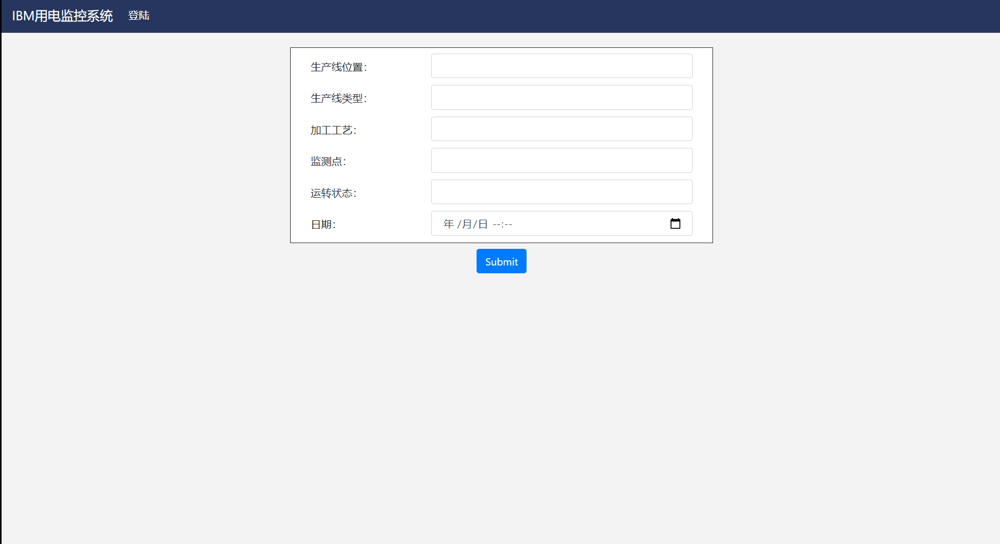

# iot-3s-2019
## 1. 项目简介
本项目是第五届3S杯全国大学生物联网技术与应用“三创”大赛的国家一等奖获奖作品，项目全名是《基于深度学习的智能电表综合应用》。项目以江苏某工厂的为期一年的电力数据作为训练数据，可以实时的对未来一天的数据进行预测，同时对可能出现的故障点进行提前预判，然后在前端反馈给工厂的管理人员。

## 2. 项目组成
殷豪(队长), 和璧, 刘璞, 程程

## 3. 项目展示
+ 在`iotshowyhh`文件目录下，运行`python manage.py runserver`, 打开任意浏览器输入`http://127.0.0.1:8000/dianbiao/`。
- 输入工厂管理数据，便可以看到如下的电表应用效果。

## 4. 项目技术方案简介
### 4.1 模型测
我们采取的3个模型的融合预测方案，分别是规则模型, lightGBM模型和LSTM模型。其中，规则模型是对电表的A相电流和C相电流做线性回归；lightGBM模型是利用3大块特征来对下一个15分钟的电力数据做预测，分别是当前时刻电力基础特征，电力时间位置特征，历史瞬时功率的统计特征。而LSTM模型则是利用过去一天的数据来预测未来一天的数据，是一次性预测出一天内24个小时每小时4个时刻的共计96点的数据。最后，经过调整，我们利用`0.2*规则 + 0.7*LGB + 0.1*LSTM`作为最终的预测结果，准确率可到95%。

### 4.2 web应用测
后端采取的是基于python的Django架构，前端采用的Boostrap的响应式框架，前端的定时刷新采用的是ajax技术，实际上应该是15分钟刷新一次数据预测更新，项目里为了快速展示，我设置的是每6秒更新一次。

## 5. 说明
谢绝任何商业用途
